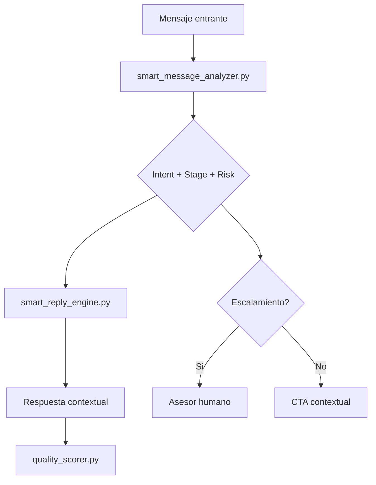

<div align="center">

# Skill ECADI

### Motor conversacional inteligente para responder cualquier mensaje con contexto, seguridad y enfoque de conversion

<p>
  <a href="./SKILL.md"></a>
  
  
  
  
</p>

<p>
  <a href="#quick-start">Quick Start</a> |
  <a href="#arquitectura">Arquitectura</a> |
  <a href="#motor-inteligente">Motor Inteligente</a> |
  <a href="#scripts">Scripts</a> |
  <a href="#references">References</a>
</p>

</div>

---

## Hero
Skill ECADI transforma mensajes libres en respuestas de alta calidad para ventas y soporte academico:

- analiza intencion, sentimiento, urgencia y riesgo,
- adapta tono y estrategia de respuesta,
- incluye nota de vigencia cuando aplica,
- decide CTA contextual (frio, tibio, caliente),
- escala automaticamente casos sensibles.

> Disenado para operacion real en WhatsApp, Messenger y canales de atencion digital.

---

## Demo Visual

<table>
  <tr>
    <td></td>
    <td></td>
  </tr>
  <tr>
    <td></td>
    <td></td>
  </tr>
</table>

Recursos adicionales:
- [horarios.png](./horarios.png)
- [video.mp4](./video.mp4)
- [Informacion ECADI.pdf](./Informacion%20ECADI.pdf)

---

## Quick Start

### 1) Clonar
```bash
git clone https://github.com/Santyofc/Skill-ECADI.git
cd Skill-ECADI
```

### 2) Probar el motor inteligente
```bash
python scripts/smart_reply_engine.py --text "hola, cuanto cuesta y como me matriculo hoy"
```

### 3) Probar cobertura de escenarios
```bash
python scripts/universal_coverage_test.py
```

### 4) Validar formato de Skill (oficial)
```bash
python "C:/Users/Dev Profile/.codex/skills/.system/skill-creator/scripts/quick_validate.py" .
```

---

## Arquitectura



Capas:
1. Analisis: intencion primaria/secundaria, sentimiento, urgencia, riesgo.
2. Estrategia: matriz de respuesta, reglas de tono y compliance.
3. Generacion: texto final con CTA y nota de vigencia.
4. Control: scoring de calidad y cobertura de casos.

---

## Motor Inteligente

### Analizador universal
Archivo: [`scripts/smart_message_analyzer.py`](./scripts/smart_message_analyzer.py)

Entrega:
- `primary_intent`
- `secondary_intents`
- `sentiment`
- `urgency`
- `stage`
- `risk_flags`
- `needs_vigencia_note`
- `needs_human_escalation`

### Generador de respuesta
Archivo: [`scripts/smart_reply_engine.py`](./scripts/smart_reply_engine.py)

Incluye:
- respuesta por intencion,
- adaptacion por sentimiento,
- soporte multilenguaje basico,
- protocolo de crisis,
- CTA por etapa del lead.

---

## Scripts

| Script | Proposito |
|---|---|
| `smart_message_analyzer.py` | Analisis profundo de cualquier mensaje |
| `smart_reply_engine.py` | Respuesta inteligente lista para enviar |
| `universal_coverage_test.py` | Test rapido de escenarios mixtos |
| `intent_classifier.py` | Clasificador rapido por keywords |
| `response_builder.py` | Constructor de borradores por intencion |
| `next_step_planner.py` | Plan de siguiente accion por barrera |
| `followup_picker.py` | Selector de seguimiento por dias |
| `quality_scorer.py` | Score heuristico de calidad (0-10) |

Ejemplos:
```bash
python scripts/smart_message_analyzer.py --text "me siento confundido y no tengo tiempo"
python scripts/smart_reply_engine.py --text "hello, what is the price and schedule?"
python scripts/quality_scorer.py --response "Con gusto te ayudo. Si quieres, te comparto el siguiente paso."
```

---

## References

El proyecto incluye una base de conocimiento extensa para operacion comercial, academica y de soporte:

- taxonomia universal de intenciones,
- matriz de estrategia de respuesta,
- protocolos de fallback y reparacion,
- adaptacion de tono y manejo emocional,
- protocolos de seguridad y crisis,
- playbooks de conversion, objeciones y seguimiento,
- escalamiento y compliance,
- KPI y etapas del lead.

Punto de entrada principal: [`SKILL.md`](./SKILL.md)

---

## Estructura del Proyecto

```text
Skill-ECADI/
├─ SKILL.md
├─ agents/
│  └─ openai.yaml
├─ scripts/
│  ├─ smart_message_analyzer.py
│  ├─ smart_reply_engine.py
│  ├─ universal_coverage_test.py
│  ├─ intent_classifier.py
│  ├─ response_builder.py
│  ├─ next_step_planner.py
│  ├─ followup_picker.py
│  └─ quality_scorer.py
├─ references/
│  └─ 37 archivos de playbooks, FAQ, compliance, escalamiento y copy
└─ assets operativos (png, pdf, audio, video)
```

---

## Seguridad y Limites

Esta skill:
- no inventa fechas/costos/promos/requisitos,
- no promete aprobacion garantizada,
- escala consultas legales o de riesgo,
- prioriza seguridad humana sobre conversion cuando hay crisis.

Protocolos clave:
- [`references/compliance-and-boundaries.md`](./references/compliance-and-boundaries.md)
- [`references/safety-and-crisis-protocol.md`](./references/safety-and-crisis-protocol.md)
- [`references/escalation-handbook.md`](./references/escalation-handbook.md)

---

## Canales Oficiales

- Facebook: https://www.facebook.com/instiecadi/?locale=es_LA
- Contacto y referencia operativa: ver [`references/canales-oficiales.md`](./references/canales-oficiales.md)

---

## Para Colaboradores

Si vas a extender la skill:

1. agrega nuevos playbooks en `references/`,
2. incorpora logica reusable en `scripts/`,
3. actualiza `SKILL.md`,
4. valida con `quick_validate.py`,
5. ejecuta `universal_coverage_test.py` antes de publicar.

---

<div align="center">

### Skill ECADI esta optimizada para convertir mensajes en decisiones

</div>
